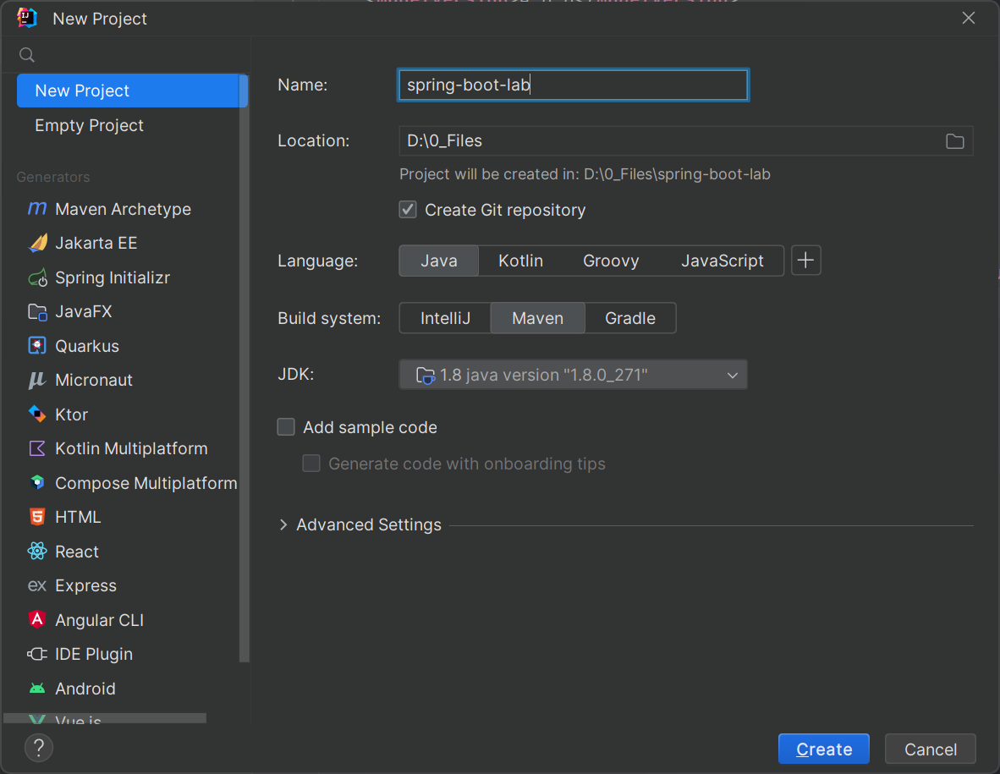
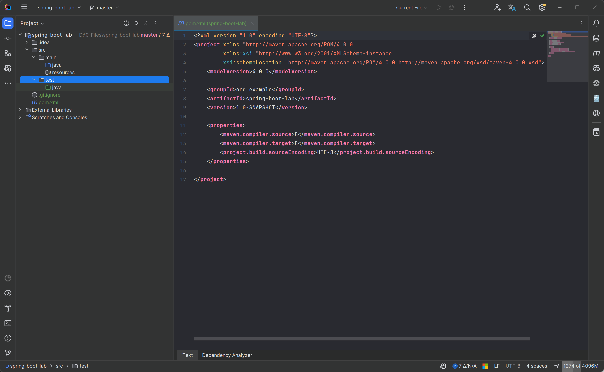
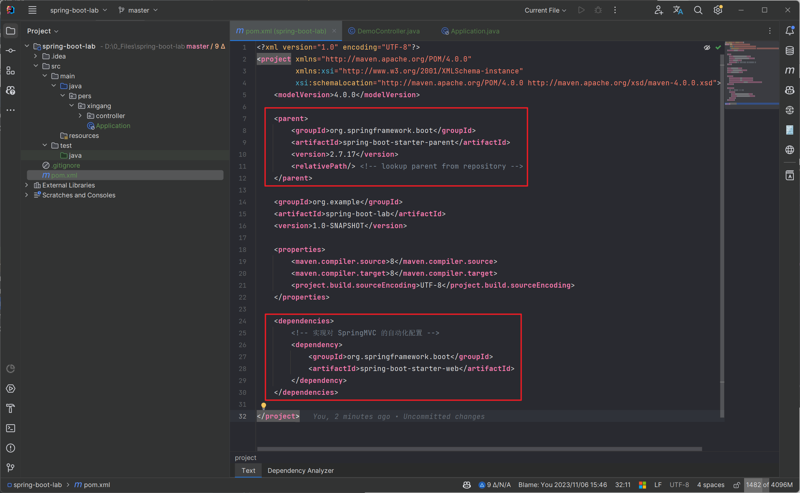
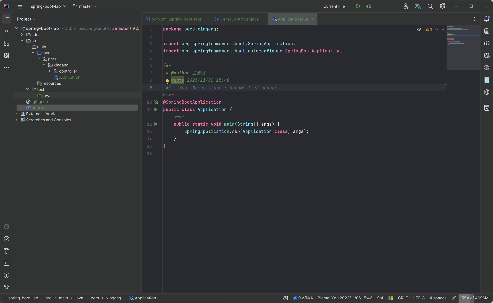
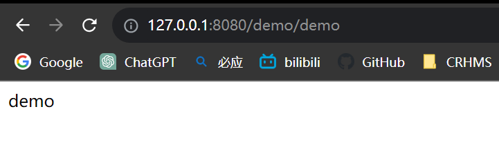

# 基于Maven 项目创建 SpringBoot 项目

> 参考：[芋道 Spring Boot 快速入门](https://www.iocoder.cn/Spring-Boot/quick-start/)

1. 创建 Maven 项目

2. 在 `pom.xml` 文件中添加依赖

3. 创建启动类

4. 创建 Controller

5. 启动项目，访问 `http:127.0.0.1:8080/demo/demo` 

# 基于 Spring 官方的 Spring Initializr

> 参考：[芋道 Spring Boot 快速入门](https://www.iocoder.cn/Spring-Boot/quick-start/)

[Spring Initializr](https://start.spring.io/)

# 基于 IDEA 中的 Spring Initializr

> 参考：[芋道 Spring Boot 快速入门](https://www.iocoder.cn/Spring-Boot/quick-start/)

