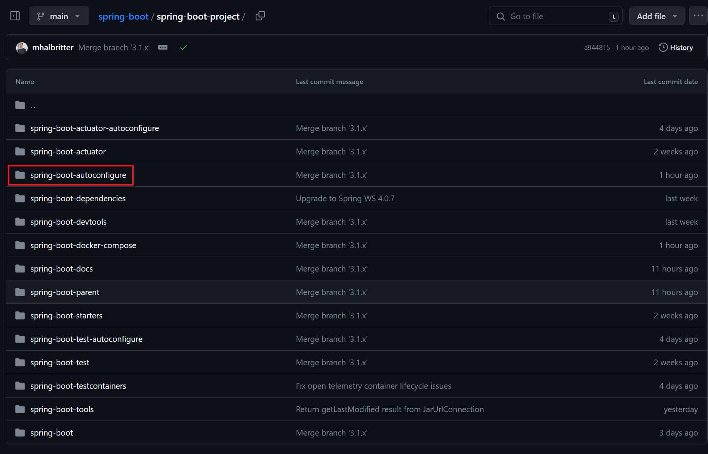
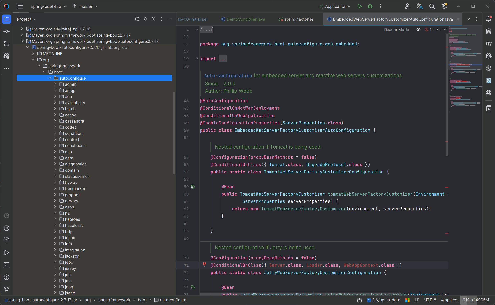
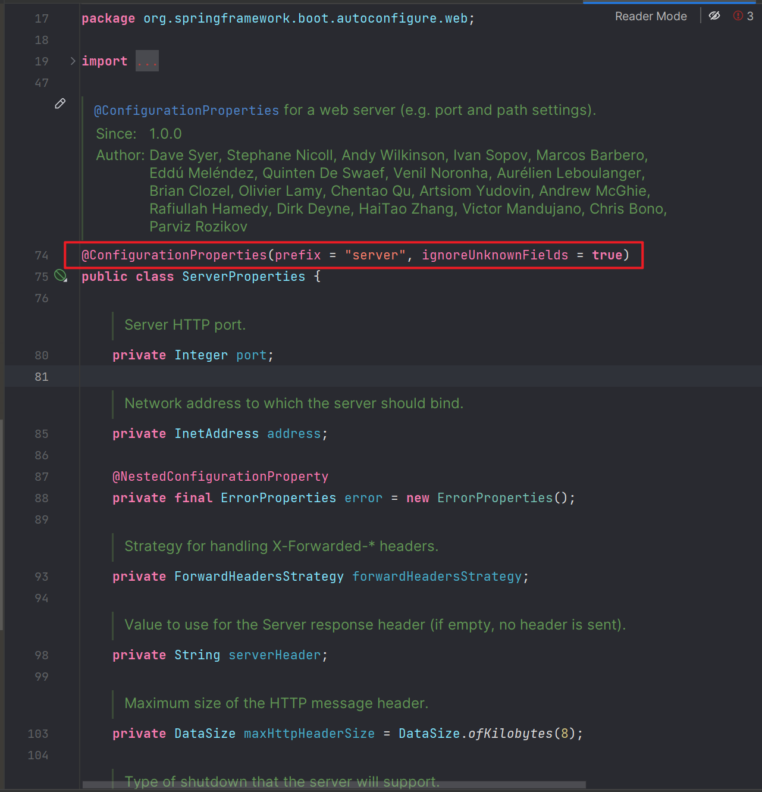

> 参考：
>
> [SpringBoot自动配置原理解析](https://mp.weixin.qq.com/s/OHdRRQl4FfqLLiEgC9gKbw)
>
> [芋道 Spring Boot 自动配置原理](https://www.iocoder.cn/Spring-Boot/autoconfigure/)


# 什么是自动配置

> [SpringBoot自动配置原理解析](https://mp.weixin.qq.com/s/OHdRRQl4FfqLLiEgC9gKbw)


- `starter` 就是自动配置的具体实现。

- SpringBoot 自动配置，顾名思义，就是希望 SpringBoot 能够自动配置我们需要用到的一些东西，将我们从配置的苦海中解脱出来。


# 如何实现自动配置


要实现自动配置，需要解决三个问题：

- 满足什么**条件**的时候需要自动装配
- 需要自动装配**哪些** Bean
- 创建的 Bean 有哪些**属性**


# SpringBoot Starter 自动装配案例


当我们引入 `spring-boot-starter-web` 依赖时，会创建一个 8080 端口的内嵌的 Tomcat，同时可以通过 `application.yml` 配置文件中的 `server.port` 配置项来自定义端口号。


当引入 `spring-boot-starter-web` 依赖时，创建 Tomcat Bean，Tomcat Bean 的属性是 `server.port` 对应的端口号。


自动装配相关的代码在 `spring-boot-autoconfigure` 模块下




负责创建内嵌的 Tomcat、Jetty 等等 Web 服务器的配置类是[EmbeddedWebServerFactoryCustomizerAutoConfiguration](https://github.com/spring-projects/spring-boot/blob/master/spring-boot-project/spring-boot-autoconfigure/src/main/java/org/springframework/boot/autoconfigure/web/embedded/EmbeddedWebServerFactoryCustomizerAutoConfiguration.java) 类




`SpringBoot 2.6.x 源码`：

```java
/*
 * Copyright 2012-2019 the original author or authors.
 *
 * Licensed under the Apache License, Version 2.0 (the "License");
 * you may not use this file except in compliance with the License.
 * You may obtain a copy of the License at
 *
 *      https://www.apache.org/licenses/LICENSE-2.0
 *
 * Unless required by applicable law or agreed to in writing, software
 * distributed under the License is distributed on an "AS IS" BASIS,
 * WITHOUT WARRANTIES OR CONDITIONS OF ANY KIND, either express or implied.
 * See the License for the specific language governing permissions and
 * limitations under the License.
 */

package org.springframework.boot.autoconfigure.web.embedded;

import io.undertow.Undertow;
import org.apache.catalina.startup.Tomcat;
import org.apache.coyote.UpgradeProtocol;
import org.eclipse.jetty.server.Server;
import org.eclipse.jetty.util.Loader;
import org.eclipse.jetty.webapp.WebAppContext;
import org.xnio.SslClientAuthMode;
import reactor.netty.http.server.HttpServer;

import org.springframework.boot.autoconfigure.EnableAutoConfiguration;
import org.springframework.boot.autoconfigure.condition.ConditionalOnClass;
import org.springframework.boot.autoconfigure.condition.ConditionalOnWebApplication;
import org.springframework.boot.autoconfigure.web.ServerProperties;
import org.springframework.boot.context.properties.EnableConfigurationProperties;
import org.springframework.context.annotation.Bean;
import org.springframework.context.annotation.Configuration;
import org.springframework.core.env.Environment;

/**
 * {@link EnableAutoConfiguration Auto-configuration} for embedded servlet and reactive
 * web servers customizations.
 *
 * @author Phillip Webb
 * @since 2.0.0
 */
@Configuration(proxyBeanMethods = false)
@ConditionalOnWebApplication
@EnableConfigurationProperties(ServerProperties.class)
public class EmbeddedWebServerFactoryCustomizerAutoConfiguration {

	/**
	 * Nested configuration if Tomcat is being used.
	 */
	@Configuration(proxyBeanMethods = false)
	@ConditionalOnClass({ Tomcat.class, UpgradeProtocol.class })
	public static class TomcatWebServerFactoryCustomizerConfiguration {

		@Bean
		public TomcatWebServerFactoryCustomizer tomcatWebServerFactoryCustomizer(Environment environment,
				ServerProperties serverProperties) {
			return new TomcatWebServerFactoryCustomizer(environment, serverProperties);
		}

	}

	/**
	 * Nested configuration if Jetty is being used.
	 */
	@Configuration(proxyBeanMethods = false)
	@ConditionalOnClass({ Server.class, Loader.class, WebAppContext.class })
	public static class JettyWebServerFactoryCustomizerConfiguration {

		@Bean
		public JettyWebServerFactoryCustomizer jettyWebServerFactoryCustomizer(Environment environment,
				ServerProperties serverProperties) {
			return new JettyWebServerFactoryCustomizer(environment, serverProperties);
		}

	}

	/**
	 * Nested configuration if Undertow is being used.
	 */
	@Configuration(proxyBeanMethods = false)
	@ConditionalOnClass({ Undertow.class, SslClientAuthMode.class })
	public static class UndertowWebServerFactoryCustomizerConfiguration {

		@Bean
		public UndertowWebServerFactoryCustomizer undertowWebServerFactoryCustomizer(Environment environment,
				ServerProperties serverProperties) {
			return new UndertowWebServerFactoryCustomizer(environment, serverProperties);
		}

	}

	/**
	 * Nested configuration if Netty is being used.
	 */
	@Configuration(proxyBeanMethods = false)
	@ConditionalOnClass(HttpServer.class)
	public static class NettyWebServerFactoryCustomizerConfiguration {

		@Bean
		public NettyWebServerFactoryCustomizer nettyWebServerFactoryCustomizer(Environment environment,
				ServerProperties serverProperties) {
			return new NettyWebServerFactoryCustomizer(environment, serverProperties);
		}

	}

}
```


**分析**：

1. 类上使用了 `@Configuration` 注解，表明这是一个配置类

   - 类内有 4 个内部配置类

     - Web 服务器 Tomcat

     - Web 服务器 Jetty

     - Web 服务器 Undertow

     - Web 服务器 Netty

   - 每个内部配置类中都加载了一个 Bean

2. 类上使用了 `@ConditionalOnWebApplication` 条件注解，表示当前配置类需要在项目是 Web 项目时才会生效。

3. 每个内部配置类上都使用了 `@ConditionalOnClass` 条件注解，表示当前配置类需要在当前项目有指定类的条件下才能生效。

4. 类上使用了 `@EnableConfigurationProperties` 注解，让 ServerProperties 配置属性类生效。

   > ServerProperties 类上使用了 @ConfigurationProperties 注解，绑定了配置文件中以 server 开头的属性到 ServerProperties 类的属性中

   


# 回答：如何实现自动配置

要实现自动配置，需要解决三个问题：

- 满足什么**条件**的时候需要自动装配
- 需要自动装配**哪些** Bean
- 创建的 Bean 有哪些**属性**


---


- @Configuration 注解可以配置创建哪些 Bean

- 像 @ConditionalOnWebApplication、@ConditionalOnClass 这样的**条件注解**，可以控制在什么条件下配置 Bean
- 通过 @EnableConfigurationProperties 和 @ConfigurationProperties  这样的注解，可以控制配置属性


==但是到目前为止还是无法完成自动配置，还需要在 spring.factories 文件中配置需要自动配置的配置类==


