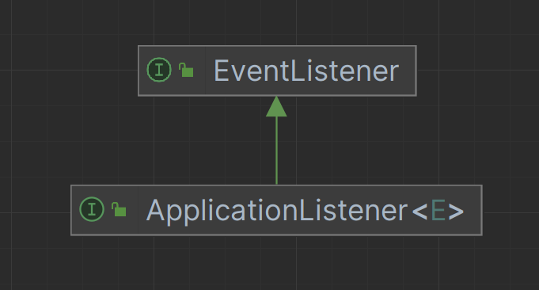

> [芋道 Spring Boot 事件机制 Event 入门](https://www.iocoder.cn/Spring-Boot/Event/?self)


# Spring 事件机制


Spring 基于观察者模式，实现了自身的事件机制，由三部分组成：

- 事件 [ApplicationEvent](https://github.com/spring-projects/spring-framework/blob/master/spring-context/src/main/java/org/springframework/context/ApplicationEvent.java)：通过**继承**它，实现自定义事件。另外，通过它的 `source` 属性可以获取事件**源**，`timestamp` 属性可以获得发生时间。
- 事件**发布者** [ApplicationEventPublisher](https://github.com/spring-projects/spring-framework/blob/master/spring-context/src/main/java/org/springframework/context/ApplicationEventPublisher.java)：通过它，可以进行事件的发布。
- 事件**监听器** [ApplicationListener](https://github.com/spring-projects/spring-framework/blob/master/spring-context/src/main/java/org/springframework/context/ApplicationListener.java)：通过**实现**它，进行指定类型的事件的监听。


> 友情提示：JDK 也内置了事件机制的实现，考虑到通用性，Spring 的事件机制是基于它之上进行拓展。因此，ApplicationEvent 继承自 [`java.util.EventObject`](https://github.com/openjdk-mirror/jdk7u-jdk/blob/master/src/share/classes/java/util/EventObject.java)，ApplicationListener 继承自 [`java.util.EventListener`](https://github.com/openjdk-mirror/jdk7u-jdk/blob/master/src/share/classes/java/util/EventListener.java)。





# 使用示范（入门）


### 定义事件

```Java
package pers.xingang.publisherlistener;

import org.springframework.context.ApplicationEvent;

/**
 * 用户注册事件
 * @author 王新刚
 * @date 2023/11/07 9:40
 */
public class UserRegisterEvent extends ApplicationEvent {

    private String userName;


    /**
     * Create a new {@code ApplicationEvent}.
     *
     * @param source the object on which the event initially occurred or with
     *               which the event is associated (never {@code null})
     */
    public UserRegisterEvent(Object source) {
        super(source);
    }

    public UserRegisterEvent(Object source, String userName) {
        super(source);
        this.userName = userName;
    }

    public String getUserName() {
        return userName;
    }
}

```


### 发送事件

```Java
package pers.xingang.publisherlistener;

import lombok.extern.slf4j.Slf4j;
import org.springframework.context.ApplicationContext;
import org.springframework.context.ApplicationEventPublisher;
import org.springframework.context.ApplicationEventPublisherAware;
import org.springframework.stereotype.Component;

/**
 * 用户服务类
 * <p>用户注册成功后发布用户注册事件</p>
 * @author 王新刚
 * @date 2023/11/07 9:46
 */
@Slf4j
@Component
public class UserService implements ApplicationEventPublisherAware {

    private ApplicationEventPublisher applicationEventPublisher;
    // ApplicationContext继承了ApplicationEventPublisher接口，也可以发送事件
    // private ApplicationContext applicationContext;

    @Override
    public void setApplicationEventPublisher(ApplicationEventPublisher applicationEventPublisher) {
        log.info("setApplicationEventPublisher");
        this.applicationEventPublisher = applicationEventPublisher;
    }

    public void register(String username) {
        log.info("  [register] [执行用户({})的注册逻辑]", username);

        log.info("  [register] [发布用户({})的注册事件]", username);
        applicationEventPublisher.publishEvent(new UserRegisterEvent(this, username));
    }
}

```


### 监听事件方式一：实现ApplicationListener

```java
package pers.xingang.publisherlistener;

import lombok.extern.slf4j.Slf4j;
import org.springframework.context.ApplicationListener;
import org.springframework.stereotype.Component;

/**
 * 邮件服务类
 * <p>用户注册成功后，发送邮件</p>
 * @author 王新刚
 * @date 2023/11/07 9:40
 */
@Slf4j
@Component
public class EmailService implements ApplicationListener<UserRegisterEvent> {
    @Override
    public void onApplicationEvent(UserRegisterEvent event) {
        log.info("  [onApplicationEvent] [给用户({})发送邮件]", event.getUserName());
    }
}

```


### 监听事件方式二：用@EventListener注解

```Java
package pers.xingang.publisherlistener;

import lombok.extern.slf4j.Slf4j;
import org.springframework.context.event.EventListener;
import org.springframework.stereotype.Component;

/**
 * 优惠券服务类
 * @author 王新刚
 * @date 2023/11/07 9:40
 */
@Slf4j
@Component
public class CouponService{
    @EventListener
    public void addCoupon(UserRegisterEvent event) {
        log.info("  [onApplicationEvent] [给用户({})发送优惠券]", event.getUserName());
    }
}

```


### 演示效果：

```Java
package pers.xingang.publisherlistener;

import org.junit.Test;
import org.junit.runner.RunWith;
import org.springframework.beans.factory.annotation.Autowired;
import org.springframework.boot.test.context.SpringBootTest;
import org.springframework.test.context.junit4.SpringRunner;

/**
 * 用户服务测试类
 * @author 王新刚
 * @date 2023/11/07 9:59
 */
@SpringBootTest(classes = Application.class)
@RunWith(SpringRunner.class)
public class UserServiceTest {

    @Autowired
    private UserService userService;

    /**
     * 用户注册
     */
    @Test
    public void register() {
        userService.register("张三");
    }
}
```


输出：


# Spring 内置的事件


## ApplicationEvent 类的子类：ApplicationContextEvent


- ContextStartedEvent：Spring Context 启动**完成**事件。
  - 类注释：Event raised when an ApplicationContext gets started.
- ContextStoppedEvent：Spring Context 停止**完成**事件。
  - 类注释：Event raised when an ApplicationContext gets stopped.
- ContextClosedEvent：Spring Context 停止**开始**事件。
  - 类注释：Event raised when an ApplicationContext gets closed.
- ContextRefreshedEvent：Spring Context 初始化或刷新**完成**事件。
  - 类注释：Event raised when an ApplicationContext gets initialized or refreshed.


`ContextStoppedEvent` 和 `ContextClosedEvent` 的区别

- Stop 是指应用程序上下文不再接受新的请求，但它仍然保持活动状态，可以在需要时重新启动。
- Close 是指应用程序上下文被销毁，无法再重新启动。通常，这发生在应用程序完全终止时。


## ApplicationEvent 类的子类：SpringApplicationEvent


- ApplicationStartingEvent：Application 启动**开始**事件。
- ApplicationEnvironmentPreparedEvent：Spring [Environment](https://github.com/spring-projects/spring-framework/blob/master/spring-core/src/main/java/org/springframework/core/env/Environment.java) 准备完成的事件。
- ApplicationContextInitializedEvent：Spring Context 准备完成，但是 [Bean Definition](https://github.com/spring-projects/spring-framework/blob/master/spring-beans/src/main/java/org/springframework/beans/factory/config/BeanDefinition.java) 未加载时的事件
- ApplicationPreparedEvent：Spring Context 准备完成，但是未刷新时的事件。
- ApplicationReadyEvent：Application 启动**成功**事件。
- ApplicationFailedEvent：Application 启动**失败**事件。

也就是说，在 Application 的整个生命周期中，会发布相应的 SpringApplicationEvent 事件。

通过 ApplicationContextEvent 和 SpringApplicationEvent 事件，我们在[《芋道 Spring Boot 持续交付 Jenkins 入门》](http://www.iocoder.cn/Spring-Boot/Jenkins/?self)文章的[「3. 优雅上下线」](https://www.iocoder.cn/Spring-Boot/Event/?self#)小节中，实现了 Spring Boot + Nginx 的优雅上下线。


# 彩蛋

① 如果胖友想要多个监听器按照指定**顺序**执行，可以通过实现 [Ordered](https://github.com/spring-projects/spring-framework/blob/master/spring-core/src/main/java/org/springframework/core/Ordered.java) 接口，指定其顺序。

② 如果胖友想要监听多种 ApplicationContext 事件，可以实现 [SmartApplicationListener](https://github.com/spring-projects/spring-framework/blob/master/spring-context/src/main/java/org/springframework/context/event/SmartApplicationListener.java) 接口，具体示例可以看看 [SourceFilteringListener](https://github.com/spring-projects/spring-framework/blob/master/spring-context/src/main/java/org/springframework/context/event/SourceFilteringListener.java) 类。

③ [`@TransactionalEventListener`](https://github.com/spring-projects/spring-framework/blob/master/spring-tx/src/main/java/org/springframework/transaction/event/TransactionalEventListener.java) 注解，可以声明在当前事务“结束”时，执行相应的监听逻辑。

④ 可以通过实现 [ApplicationEventMulticaster](https://github.com/spring-projects/spring-framework/blob/master/spring-context/src/main/java/org/springframework/context/event/ApplicationEventMulticaster.java) 接口，定义自定义的事件广播器，可以往里面添加和移除监听器，并发布事件给注册在其中的监听器。使用比较少，基本可以忽略。
